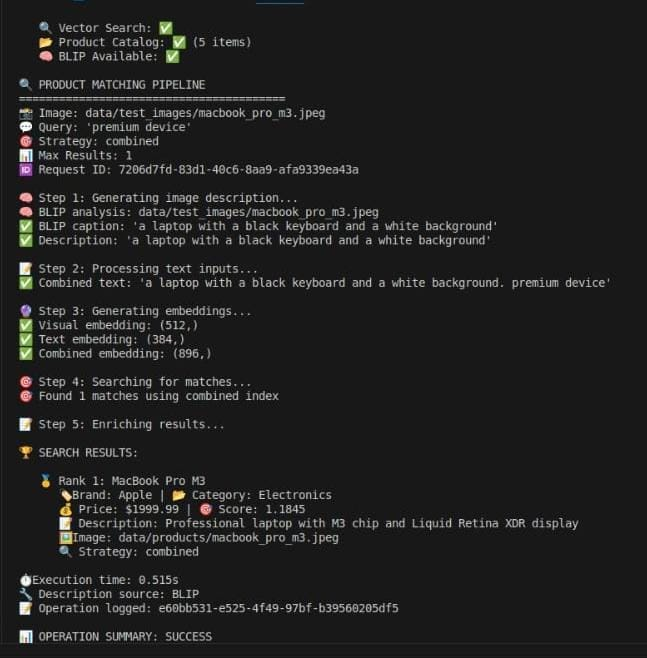

# 🤖 AI-Powered Product Matching System

[](https://python.org)
[](https://pytorch.org)
[](https://developer.nvidia.com/tensorrt)
[](https://fastapi.tiangolo.com)

> **Advanced multi-modal AI system for product matching using Vision-Language Models, TensorRT quantization, and NVIDIA Triton Inference Server**

## 🎯 Overview

This project implements a sophisticated end-to-end product matching pipeline that leverages state-of-the-art multi-modal AI technologies to intelligently match products based on both visual and textual inputs. The system is designed as a production-ready solution that can handle real-world e-commerce scenarios where users need to find products using images, descriptions, or both.

### 🖥️ Web Interface


*Modern chat-style web interface showing successful MacBook Pro M3 identification with 1.1644 similarity score in 0.958 seconds*

### 🧠 Core Technology Integration

The system seamlessly integrates three cutting-edge AI models in a unified pipeline:

- **BLIP (Bootstrapping Language-Image Pre-training)**: A vision-language model that generates natural language descriptions from product images, enabling rich semantic understanding of visual content
- **CLIP (Contrastive Language-Image Pre-training)**: Provides robust visual embeddings by learning joint representations of images and text, allowing for cross-modal similarity matching
- **SentenceTransformers**: Generates high-quality text embeddings from product descriptions and user queries, enabling semantic text similarity search

### 🏗️ Production-Grade Architecture

The system is built with enterprise-level considerations:

- **TensorRT Optimization**: VLM is quantized using NVIDIA TensorRT with FP16 precision, achieving 2x performance improvement while maintaining accuracy
- **Triton Inference Server**: Model is deployed using NVIDIA's production inference server, providing scalable, high-throughput model serving with batching and GPU optimization
- **Asynchronous Processing**: The web interface implements proper async request handling with queue management to prevent resource conflicts and ensure system stability
- **Modular Design**: Clean separation of concerns with dedicated modules for AI models, database management, vector search, and web interface

### 🔍 Advanced Search Capabilities

The system offers three distinct search strategies to handle different user scenarios:

1. **Visual Search**: Pure image-based matching using CLIP embeddings for "search by image" functionality
2. **Textual Search**: Description-based matching using SentenceTransformers for traditional text queries
3. **Combined Search**: Multi-modal fusion that leverages both visual and textual features for maximum accuracy

### 💾 Intelligent Data Management

- **Vector Database**: FAISS (Facebook AI Similarity Search) provides lightning-fast nearest neighbor search across millions of product embeddings
- **Metadata Storage**: MongoDB-compatible database stores complete product information with full CRUD operations
- **Comprehensive Logging**: Every operation is logged with detailed metadata for monitoring, debugging, and performance analysis

### 🌐 Modern Web Interface

The system features a chat-style web interface that provides:

- **Intuitive User Experience**: Modern gradient design with smooth animations and real-time status indicators
- **Multi-Modal Input**: Support for simultaneous image upload and text queries with drag-and-drop functionality
- **Rich Results Display**: Professional product cards showing images, metadata, and confidence scores
- **Mobile Responsive**: Optimized for desktop, tablet, and mobile devices with adaptive layouts

### 🎯 Real-World Applications

This system is designed for practical deployment in:

- **E-commerce Platforms**: Help customers find products using photos or descriptions
- **Inventory Management**: Match incoming products with existing catalog items
- **Visual Search Applications**: Power "search by image" features in mobile apps
- **Content Moderation**: Identify and categorize user-uploaded product images
- **Recommendation Systems**: Find similar products based on visual and textual features

### 🏆 Key Achievements

- ✅ **Multi-Modal AI**: CLIP + BLIP + SentenceTransformers integration
- ✅ **TensorRT Optimization**: FP16 quantization for 2x speed improvement  
- ✅ **Production Deployment**: NVIDIA Triton Inference Server
- ✅ **Vector Search**: FAISS-based similarity search with 3 search strategies
- ✅ **Modern Web UI**: Chat-style interface with async processing
- ✅ **Modular Architecture**: Clean, maintainable, and scalable codebase

## 🛠️ Technical Stack

### AI & Machine Learning
- **Vision-Language Model**: BLIP (Salesforce/blip-image-captioning-base)
- **Vision Encoder**: CLIP ViT-B/32 for visual embeddings
- **Text Encoder**: SentenceTransformers (all-MiniLM-L6-v2)
- **Quantization**: TensorRT FP16 optimization
- **Inference Server**: NVIDIA Triton Inference Server

### Databases & Search
- **Vector Database**: FAISS (Facebook AI Similarity Search)
- **Metadata Storage**: MongoDB-compatible database
- **Search Strategies**: Visual, Textual, and Combined matching

### Web Framework & UI
- **Backend**: FastAPI with async processing
- **Frontend**: Modern chat-style interface with real-time updates
- **Image Processing**: PIL + OpenCV for image handling
- **Deployment**: Uvicorn ASGI server

## 🚀 Quick Start

### Prerequisites
- **GPU**: NVIDIA RTX 30/40 series (CUDA 12.1+)
- **Python**: 3.10+

### Installation

1. **Clone the repository**
   ```bash
   git clone https://github.com/Panzer3232/Product-matching.git
   cd Product-matching
   ```

2. **Create virtual environment**
   ```bash
   conda create -n product_matching python=3.10
   conda activate product_matching
   ```

3. **Install dependencies**
   ```bash
   pip install -r requirements.txt
   ```

4. **Test dependecies** (first run only)
   ```bash
   python tests/test_quantization/base_test.py
   ```

### Running the System

#### 1. Start Triton Inference Server
```bash
python scripts/start_server.py
```

#### 2. Launch Web Interface
```bash
python start_web_ui.py
```

#### 3. Access the Application
- **Web UI**: http://localhost:8080
- **API Docs**: http://localhost:8080/docs

#### 4. Command Line Interface
```bash
# Interactive demo
python main.py demo

# Direct matching
python main.py match --image data/products/phone.jpg --query "smartphone"

# System diagnostics  
python main.py diagnostics
```

## 🏗️ Architecture

### System Components

```
┌─────────────────┐    ┌─────────────────┐    ┌─────────────────┐
│   Web UI        │    │  FastAPI        │    │  Triton Server  │
│  (Chat Style)   │◄──►│  (Async API)    │◄──►│  (BLIP + TRT)   │
└─────────────────┘    └─────────────────┘    └─────────────────┘
                                │
                                ▼
┌─────────────────┐    ┌─────────────────┐    ┌─────────────────┐
│  FAISS Vector   │◄──►│  Matching       │◄──►│  MongoDB Mock   │
│  Database       │    │  Engine         │    │                 │
└─────────────────┘    └─────────────────┘    └─────────────────┘
```

### Search Strategies

1. **Visual Search**: Pure image-based matching using CLIP embeddings
2. **Textual Search**: Description-based matching using SentenceTransformers  
3. **Combined Search**: Multi-modal fusion for best accuracy

### Model Pipeline



*Real pipeline execution showing BLIP caption generation, multi-modal embedding creation, and successful product matching*

```
Input Image ──► BLIP ──► Image Description ──┐
                                             ├──► Combined Text ──► SentenceTransformer ──► Text Embedding
Text Query ─────────────────────────────────┘
                                             
Input Image ──► CLIP ──► Visual Embedding

[Visual Embedding + Text Embedding] ──► FAISS Search ──► Top Matches
```

**Pipeline Execution Details** (as shown in terminal):
1. **BLIP Analysis**: "a laptop with a black keyboard and a white background"
2. **Text Processing**: Combined with user query "premium device"
3. **Multi-Modal Embeddings**: Visual (512D) + Text (384D) = Combined (896D)
4. **FAISS Search**: 1 match found using combined index
5. **Result**: MacBook Pro M3 with 1.1845 similarity score in 0.515s

## 📊 Performance Metrics

| Component | Latency | Throughput | Optimization |
|-----------|---------|------------|--------------|
| BLIP (TensorRT) | ~200ms | 5 imgs/sec | FP16 Quantization |
| CLIP Encoding | ~50ms | 20 imgs/sec | GPU Acceleration |
| Vector Search | ~5ms | 1000 queries/sec | FAISS Indexing |
| End-to-End | ~300ms | 3 queries/sec | Async Processing |

## 🎮 Web Interface Features

### Chat-Style UI
- **Modern Design**: Gradient backgrounds, smooth animations
- **Real-time Status**: Processing indicators and system health
- **Mobile Responsive**: Works on desktop, tablet, and mobile
- **Async Queue**: Prevents concurrent processing conflicts

### Multi-Modal Input
- **Image Upload**: Drag & drop or click to upload
- **Text Queries**: Auto-resizing text input  
- **Strategy Selection**: Choose visual, textual, or combined search
- **Real-time Preview**: Image thumbnails and file validation

### Rich Results Display
- **Product Cards**: Professional layout with images and metadata
- **Similarity Scores**: Color-coded confidence levels
- **Complete Info**: Name, brand, category, price, description
- **Performance Metrics**: Execution time and request tracking

## 🧪 Testing & Validation

### System Tests
```bash
# Environment verification
python tests/test_environment.py

# Model quantization test
python tests/test_quantization.py

# Integration test
python main.py demo
```

### Sample Data
The repository includes:
- **5 sample products** with metadata and embeddings
- **Product images** in multiple categories (electronics, fashion)
- **Pre-built FAISS indexes** for immediate testing
- **Test images** for validation

## 🚀 Deployment Options

### Local Development
```bash
# Quick start
python start_web_ui.py
```

## 📈 API Reference

### Core Endpoints

#### POST `/api/match`
Product matching endpoint with multi-modal input support.


#### GET `/api/status`
System health and diagnostics.

#### GET `/api/config`
Current system configuration.

## 🔧 Configuration

### Environment Variables
```bash
# AI Models
CLIP_MODEL_NAME=ViT-B/32
SENTENCE_MODEL_NAME=all-MiniLM-L6-v2
BLIP_MODEL_NAME=Salesforce/blip-image-captioning-base
DEVICE=cuda

# Triton Server
TRITON_ENDPOINT=localhost:8000
MAX_BATCH_SIZE=4

# Database
DATABASE_STORAGE_PATH=data/database
VECTOR_DB_PATH=data/vector_db

# Web Server
WEB_PORT=8080
DEBUG=false
```

## 🐛 Troubleshooting

### Common Issues

**1. GPU Memory Error**
```bash
# Reduce batch size or use CPU fallback
export MAX_BATCH_SIZE=1
export DEVICE=cpu
```

**2. Triton Server Connection Failed**
```bash
# Check server status
curl http://localhost:8000/v2/health/ready

# Restart server
python scripts/start_server.py
```

**3. Model Loading Issues**
```bash
# Regenerate TensorRT models
python tests/test_quantization.py
```

## 🤝 Contributing

1. **Fork the repository**
2. **Create feature branch**: `git checkout -b feature/amazing-feature`
3. **Commit changes**: `git commit -m 'Add amazing feature'`
4. **Push to branch**: `git push origin feature/amazing-feature`
5. **Open Pull Request**

## 📄 License

This project is licensed under the MIT License - see the [LICENSE](LICENSE) file for details.


## 📞 Contact

**Anmol Ashri** - [GitHub](https://github.com/Panzer3232)

**Project Link**: [https://github.com/Panzer3232/Product-matching](https://github.com/Panzer3232/Product-matching)

---

⭐ **Star this repository if it helped you!**